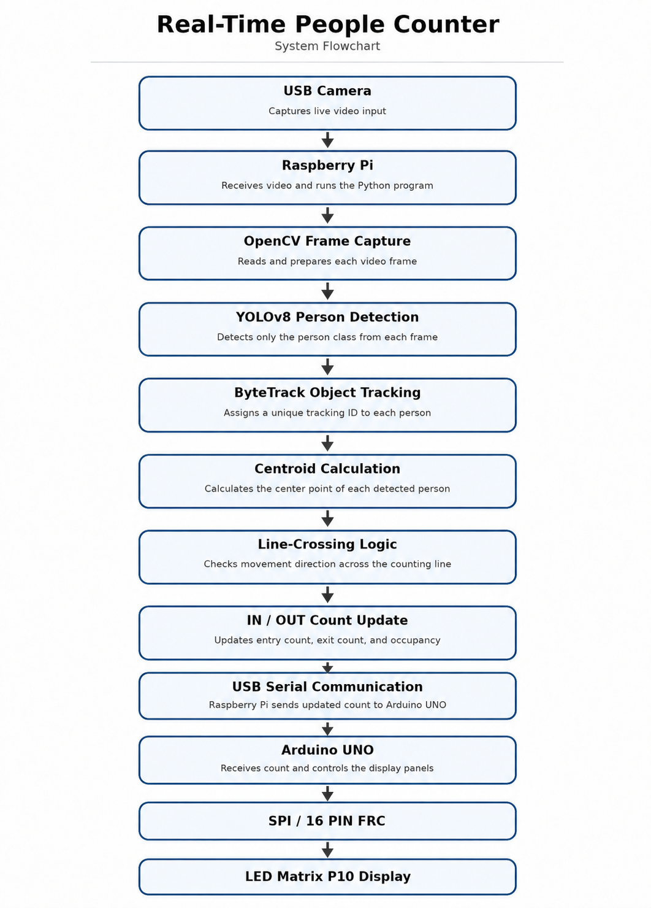

Copy-paste this directly in GitHub `README.md` edit section:

# Real-Time People Counter using Raspberry Pi and Arduino

This project is a real-time people counting system developed using Raspberry Pi, YOLOv8 object detection, ByteTrack tracking, Arduino UNO, and P10 LED matrix display panels.

The system uses a USB camera connected to the Raspberry Pi to capture live video. The Raspberry Pi processes the video frames using OpenCV and detects people using the YOLOv8 model. ByteTrack is used to track each detected person and assign a unique tracking ID.

A counting line is placed in the video frame. When a person crosses the line in one direction, the IN count is increased. When a person crosses the line in the opposite direction, the OUT count is increased. Based on this logic, the system calculates the total number of people inside.

Whenever the total count changes, the Raspberry Pi sends the updated count value to the Arduino UNO through USB serial communication using the Arduino USB port. The Arduino receives this count and displays the date, time, and total people count on the P10 LED matrix display panels.

This project demonstrates the integration of computer vision, object tracking, Raspberry Pi, Arduino, serial communication, and LED display interfacing for real-time occupancy monitoring.

---

## Project Flow

```text
USB Camera
   ↓
Raspberry Pi
   ↓
OpenCV Frame Capture
   ↓
YOLOv8 Person Detection
   ↓
ByteTrack Object Tracking
   ↓
Centroid Calculation
   ↓
Line-Crossing Logic
   ↓
IN / OUT Count Update
   ↓
USB Serial Communication
   ↓
Arduino UNO
   ↓
SPI / 16 PIN FRC
   ↓
LED Matrix P10 Display
```

---

## Block Diagram



---

## Hardware Used

* Raspberry Pi
* USB Camera
* Arduino UNO
* P10 LED Matrix Display Panels
* 16 PIN FRC Cable
* USB Cable
* Jumper Wires
* Power Supply

---

## Software and Libraries Used

### Raspberry Pi

* Python
* OpenCV
* Ultralytics YOLOv8
* ByteTrack
* PySerial
* NumPy

### Arduino

* Arduino IDE
* SPI Library
* DMD2 Library
* SystemFont5x7 Font

---

## Installation

Create a Python virtual environment:

```bash
python3 -m venv myenv
```

Activate the virtual environment:

```bash
source myenv/bin/activate
```

Install the required Python libraries:

```bash
pip install -r requirements.txt
```

---

## Python Requirements

The `requirements.txt` file contains:

```txt
opencv-python
ultralytics
pyserial
numpy
```

---

## Raspberry Pi Code

The Raspberry Pi code is available in:

```text
rpi_people_counter.py
```

This code performs the following operations:

* Captures video from the USB camera
* Detects people using YOLOv8
* Tracks detected people using ByteTrack
* Calculates the centroid of each detected person
* Applies line-crossing logic
* Updates IN count, OUT count, and total occupancy
* Sends the total count to Arduino UNO through USB serial communication

---

## Arduino Code

The Arduino code is available in:

```text
arduino_p10_display/arduino_p10_display.ino
```

This code performs the following operations:

* Receives count value from Raspberry Pi through USB serial communication
* Converts received serial data into integer format
* Updates software-based date and time
* Sends display data to the P10 LED matrix display using SPI / 16 PIN FRC connection
* Displays date, time, and total count on the LED matrix display

---

## Communication Method

### Raspberry Pi to Arduino UNO

```text
Raspberry Pi USB Port → USB Cable → Arduino UNO USB Port
```

The Raspberry Pi sends the updated count value to the Arduino UNO using USB serial communication.

### Arduino UNO to P10 LED Matrix Display

```text
Arduino UNO → SPI / 16 PIN FRC → LED Matrix P10 Display
```

The Arduino UNO controls the P10 LED matrix display using SPI-based communication through the DMD2 library and 16 PIN FRC cable.

---

## Display Output

The P10 LED matrix display shows:

```text
DATE | TIME | COUNT
```

Example:

```text
27/03 | 01:10 | 5
```

---

## Folder Structure

```text
People-Counter-RPi-Arduino/
│
├── README.md
├── requirements.txt
├── rpi_people_counter.py
│
├── arduino_p10_display/
│   └── arduino_p10_display.ino
│
└── images/
    └── block_diagram.png
```

---

## Applications

* Classroom occupancy monitoring
* Library people counting
* Seminar hall occupancy tracking
* Office entry and exit monitoring
* Smart building automation
* IoT-based people monitoring system

---

## Future Improvements

* Add RTC module for accurate date and time
* Store count data in a database
* Add web dashboard for remote monitoring
* Improve accuracy using two-line counting logic
* Add cloud connectivity
* Add admin reset or control button

---

## Note

The date and time displayed in this project are generated using software logic in Arduino. For accurate real-time date and time, an RTC module such as DS3231 can be added.

---

## Author

Paras Mane
Electronics and Telecommunication Engineering
Government College of Engineering, Karad
